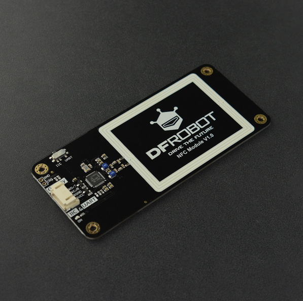

# DFRobot_PN532
- [English Version](./README.md)

PN532是一个高度集成的传输模块，用于13.56 MHz的非接触式通信，包括基于80C51核心<br>
的微控制器功能，40kbytes ROM和1kbytes RAM。<br>
PN532结合了调制和解调的概念，完全集成了不同种类的非接触式通信方法和协议，在13.56<br>
 MHz与易于使用的固件，为不同的支持模式和所需的主控制器接口。<br>





## 产品链接 (https://www.dfrobot.com.cn/goods-2029.html)
    SKU: DFR0231-H

## 目录

  * [概述](#概述)
  * [库安装](#库安装)
  * [方法](#方法)
  * [兼容性](#兼容性)
  * [历史](#历史)
  * [创作者](#创作者)
## 概述

这个例子是关于pn532芯片读写卡的。

## 库安装

使用此库前，请首先下载库文件，将其粘贴到\Arduino\libraries目录中，然后打开examples文件
夹并在该文件夹中运行演示。

## 方法

```C++	

   /*!
    * @fn readData
    * @brief 读取nfc卡中一个block的所有数据(每一个block中有 16 byte 的数据)
    * @param buffer 缓存已经读到数据的
    * @param block 要读取block的编号.
    * @return 状态码. 
    * @retval 1 成功读取数据
    * @retval -1 读取数据失败
    */   
   uint8_t readData(uint8_t *buffer,uint8_t block);

   /*!
    * @fn readData
    * @brief 读取nfc卡片中某一个block中的某一个数据(每一个block中有 16 byte 的数据)
    * @param block 要读取的block的编号
    * @param offset 要读取数据在block中的偏移. 
    * @return 从nfc卡片中读到的一个数据. 
    */  
   uint8_t readData(int block, uint8_t offset);

   /*!
    * @fn writeData
    * @brief 写一个数据道到nfc卡片中.
    * @param block 需要写入数据的block.
    * @param num 需要写入数据在block中的偏移. 
    * @param data 要写入的数据.
    */  
   void writeData (int block, uint8_t num ,uint8_t data);

   /*!
    * @fn scan
    * @brief  扫描是否有nfc卡片. 
    * @return 布尔类型, 扫描的结果
    * @retval true 发现一个nfc卡片.
    * @retval false 未发现卡片
    */ 
   bool  scan(void);

   /*!
    * @fn scan
    * @brief Scan 扫描是否存在一个特定id的nfc卡片
    * @param nfcuid UID.
    * @return 布尔类型, 扫描的结果
    * @retval true 存在一个特定UID的卡片
    * @retval false 不存在一个特定UID的卡片
    */   
   bool  scan(String nfcuid);

   /*!
    * @fn readUid
    * @brief 获取卡片的UID .
    * @return UID .
    */  
   String  readUid();

   /*!
    * @fn writeData
    * @brief 写一个block的数据到nfc卡片中(每一个block中有 16 byte 的数据).
    * @param block 要写入block的编号.
    * @param data 要写入的数据. 
    */  
   bool  writeData(int block, uint8_t data[]);

   /*!
    * @fn readUltralight
    * @brief 读取一个block的数据从 Ultralight类型的nfc卡片
    * @param buffer 缓存读到数据的buffer. 
    * @param block 要读取block的编号.
    * @return 错误码
    */
   uint8_t readUltralight(uint8_t *buffer,uint8_t block);

   /*!
    * @fn writeUltralight
    * @brief 写一个block的数据到Ultralight类型的nfc卡片
    * @param block 需要写入的block的编号.
    * @param data 需要写入的数据. 
    * @return 布尔类型, 写入的结果
    * @retval true 写成功
    * @retval false 写失败
    */
   bool  writeUltralight(int block, uint8_t data[]);

   /*!
    * @fn readNTAG
    * @brief 读取一个block的数据从NTAG类型的nfc卡片
    * @param buffer 缓存读到数据的buffer. 
    * @param block 要读取block的编号.
    * @return 错误码
    * @retval 1 读取成功
    * @retval -1 读取失败
    */
   uint8_t readNTAG(uint8_t *buffer,uint8_t block);

   /*!
    * @fn writeNTAG
    * @brief 写一个block的数据到NTAG类型的nfc卡片
    * @param block 需要写入的block的编号.
    * @param data 需要写入的数据. 
    * @return 布尔类型, 写入的结果
    * @retval true 写成功
    * @retval false 写失败
    */
   bool  writeNTAG(int block, uint8_t data[]);

   /*!
    * @fn readData
    * @brief 读取NFC卡片的基本信息. 
    * @return 保存信息的结构体.
    */
   sCard_t getInformation();
	 
```
## Compatibility
主板                | read and write   | Can be accurately identified？ | Remarks
------------------- | :--------------: | :----------------------------: |-----
Mifareclassic S50   |      √           |      √                         | 
Mifareclassic S70   |      √           |      √                         |                         
NTAG 213            |      √           |       √                         |        
NTAG 215            |      √           |       √                         |    
NTAG 216            |      √           |       √                         |          
Ultralight          |      √           |       √                         |           


## Compatibility

主板                | Work Well    | Work Wrong   | Untested    | Remarks
------------------ | :----------: | :----------: | :---------: | -----
Arduino Uno        |      √       |              |             | 
Mega2560        |      √       |              |             | 
ESP32        |      √       |              |             | 
micro:bit         |      √       |              |             | 

## 历史


- 2019/10/15 - Version 1.0.0 released.


## 创作者

Written by fengli(li.feng@dfrobot.com), 2020.7.31 (Welcome to our [website](https://www.dfrobot.com/))